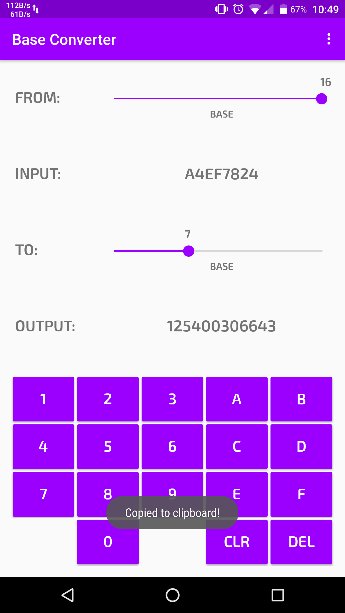
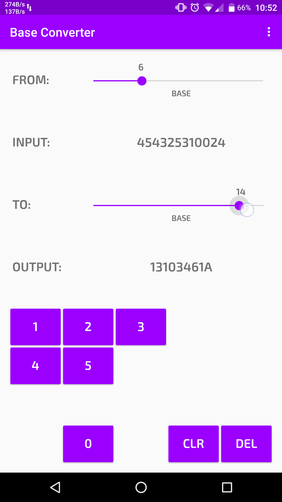

# Base Converter
Android application.

Converts numbers from one base to another supporting base 2 through 16.

Can be downloaded here: https://play.google.com/store/apps/details?id=com.nicoqueijo.android.baseconverter

